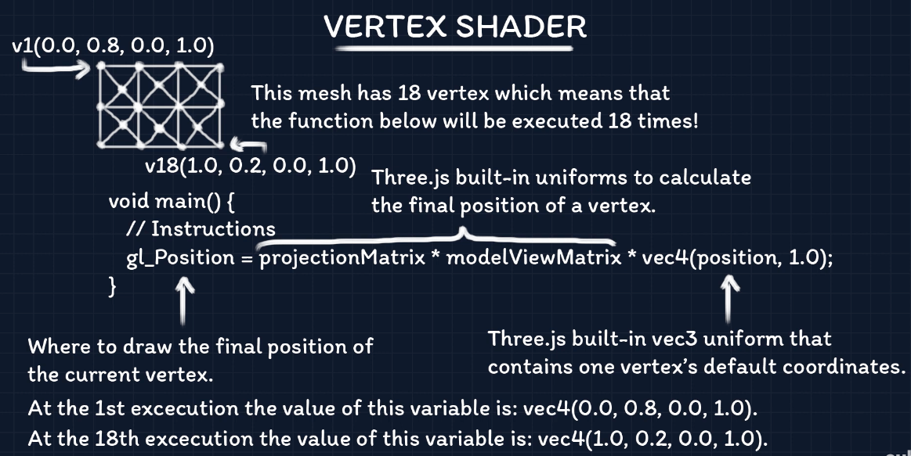
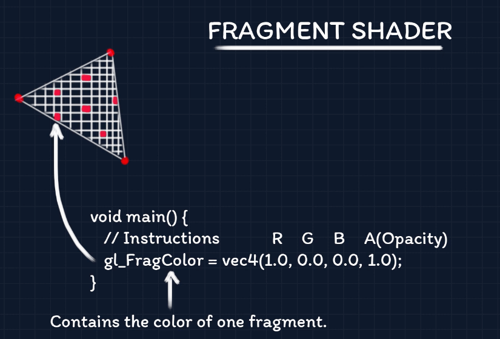

# Three.js Tutorial

Three.js Tutorial by Wael Yasmina

## folder structures

- 01-initial-tutorial
  - everything
- 02-solar-system
- 02-z1-solar-system-ts
- x01-impossibox
  - interesting cube box in TypeScript by [kandabi](https://github.com/kandabi/threejs-impossibox)

# Details

<details open> 
  <summary>Click to Contract/Expend</summary>

## 1. WebGL In A Nutshell

- OpenGL
- WebGL
  - Shaders
    - Vertex Shader
    - Fragment Shader
- GLSL ES
- WebGPU
  - babylon.js

## 2. Three.js Tutorial For Absolute Beginners

```sh
npm install parcel --save-dev
npm install three

parcel ./src/index.html
```

### Camera types

1. Perspective Camera: depending on angle, the sizes are different
2. Orthographic Camera: same size from the front view

### MeshStandardMaterial

MeshStandardMaterial needs

[npm dat.gui](https://www.npmjs.com/package/dat.gui) - A lightweight graphical user interface for changing variables in JavaScript

```sh
npm install dat.gui
```

## 2-1. Solar system in TypeScript

```sh
tsc --init
```

## 3. How To Export 3D Models With Their Animation From Blender And Import Them Into Your Three.js App

[three.js editor(playground)](https://threejs.org/editor)

### Lights

- AmbientLight: e.g. Daylight
- DirectionalLight: e.g. Sunlight
- SpotLight

## 4. GLSL & Shaders Tutorial - Understanding The Syntax And The Idea Behind The Vertex & Fragment Shaders

- GLSL: OpenGL Shading Language,
- Browser (Javascript) -> GPU (Monitor)
- [GLSL Documentation](<https://www.khronos.org/opengl/wiki/Core_Language_(GLSL)#Types>)

### Math for game devs such as vectors, and so on

https://www.youtube.com/@Acegikmo/playlists

### [Data types (GLSL)](<https://www.khronos.org/opengl/wiki/Data_Type_(GLSL)>)

#### Vectors

- vec
  - vec2
  - vec3
  - vec4
- ivec
  - ivec2
  - ivec3
  - ivec4
- bvec
  - bvec2
  - bvec3
  - bvec4

```js
vec2 vectA = vec2(1.0, 6.0);
bvec4 vectB = bvec4(true, true, false, false);

// Same as: vec3 vectC = vec3(0.0, 0.0, 0.0);
vec3 vectC = vec3(0.0);

// vectD value is: vec2(0.0, 0.0);
vec2 vectD = vec2(vectC);

//vectE value is: vec4(0.0, 0.0, 1.0, 6.0);
vec4 vectE = vec4(vectC, vectA);
```

#### Vectors (continue)

```js
vec4 vect = vec4(1.0, 2.0, 3.0, 4.0);

// a1 == a2 == a3 == 1.0
flaot a1 = vect.x;
flaot a2 = vect.r;
flaot a3 = vect.s;

// b1 == b2 == b3 == 2.0
flaot b1 = vect.y;
flaot b2 = vect.g;
flaot b3 = vect.t;

// c1 == c2 == c3 == 3.0
flaot c1 = vect.z;
flaot c2 = vect.b;
flaot c3 = vect.p;

// d1 == d2 == d3 == 4.0
flaot d1 = vect.w;
flaot d2 = vect.a;
flaot d3 = vect.q;
```

> can choose right alphabet depending on the context

- Vertices: xyzw
- Colors: rgba
- Textures: stpq

```js
vec3 vectA = vec3(1.0, 2.0, 3.0);

// vectB value is: vec2(1.0, 3.0);
vec2 vectB = vectA.xz;

// vectC value is: vec3(1.0, 1.0, 1.0);
vec3 vectC = vectA.rrr;

// vectD value is: vec2(3.0, 1.0);
vec2 vectD = vectA.br;
```

#### Matrices

- mat2: {x1, x2, y1, y2}
- mat3: {}
- mat4: {}

```js
// matA value is: mat2(1.0, 1.0, 0.0, 0.0)
mat2 matA = mat2(1, 1, false, false);
// 7.0  0.0  1.0
// 4.0  2.0  3.0
// 5.0  5.0  7.0
mat3 matB = mat3(7.0, 4.0, 5.0, 0.0, 2.0, 5.0, 1.0, 3.0, 7.0);

// vectC1 value is: vec3(7.0, 4.0, 5.0)
vec3 vectC1 = matB[0];

// Replaces 7.0 by 100.0
matB[2][2] = 100.0;

// f value is: 4.0
// Same as matB[0][1]
flaot f = matB[0]y;
```

#### Samplers

- sampler2D
- samplerCube

#### Structures

```c
struct myType {
  int c1;
  vect3 c2;
}

myType a;
```

#### Functions

```c
float funcA(int a, vec2 b) {
  // Stuff to do
  return 1.0;
}
void funcB(vec3 vect) {
  // Stuff todo
  // No return
}
```

##### Prototype

```c
vec2 funcE(float x, float y);
vect2 vect = funcE(1.0, 1.0);
vec2 funcE(float x, float y) {
  return vec2(1.0, 2.0);
}
```

### [Qualifiers](<https://www.khronos.org/opengl/wiki/Type_Qualifier_(GLSL)>)

#### Storage Qualifiers

- const: `const type variable_identifier = value;`
- attribute: `attribute type variable_identifier;`
- uniform: `uniform type variable_identifier;`
- varying: `varying type variable_identifier;`

#### Precision Qualifiers

- lowp
- mediump
- highp

```c
// precision_qualifier type variable_identifier;
mediump flaot f;

// precision precision_qualifier type;
precision highp vec2
```

### Shaders

A shader is a program written in GLSL

- Vertex shader
- Fragment shader

#### Vertex Shader



#### Fragment Shader



### uniform

- in GLSL, sometimes, there's no way to get some information that javascript can get.
- then we can use uniform to pass that values

## 5. Cannon.js Tutorial For Beginners - Add Gravity, Collision, And Other Physics Laws To Your 3D Web App

- [npm cannon-es](https://www.npmjs.com/package/cannon-es)
- [cannon-es documentation](https://pmndrs.github.io/cannon-es/docs/)

```sh
npm install cannon-es
```

### 9. How To Find The Materials Of A Loaded Model - Three.js Tutorial

Credits

- Wireframe human model
  - https://openclipart.org/detail/260560/low-poly-human-male-wireframe#google_vignette
- Model
  - https://quaternius.com/ (many free 3d models)

#### 3 ways to inspect a model

1. `console.log()`
2. using graphic design tool such as `blender` or `gestaltor`
3. (recommend) using three.js official online editor, `https://threejs.org/editor/`
   - add `DirectionalLight`

### 10. Cloning And Animating Models Loaded From glTF Files - Three.js Tutorial

A tool that can clone a model and so on

```js
import * as SkeletonUtils from 'three/examples/jsm/utils/SkeletonUtils';
```

</details>
